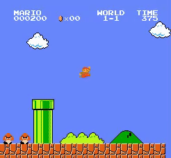
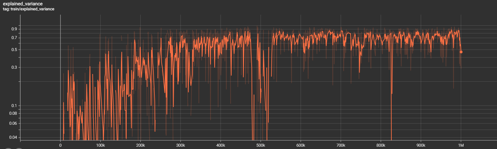

# Super Mario Bros AI Agent using PPO

This project trains a Reinforcement Learning (RL) agent to play the classic NES game Super Mario Bros. It utilizes the `gym-super-mario-bros` environment and the Proximal Policy Optimization (PPO) algorithm implemented in the `stable-baselines3` library.

Here's a demonstration of the trained agent playing the game:



Below shows the explained variance over training steps:



## Features

* **Environment:** Uses `gym-super-mario-bros` for the game environment.
* **RL Algorithm:** Employs Proximal Policy Optimization (PPO) from `stable-baselines3`.
* **Preprocessing:**
    * `JoypadSpace`: Simplifies the action space to common movements.
    * `GrayScaleObservation`: Converts observations to grayscale to reduce state complexity.
    * `VecFrameStack`: Stacks consecutive frames to provide the agent with temporal information (motion).
* **Compatibility:** Includes a `SeedFixWrapper` to handle potential API changes in `env.reset()` between `gym` and `gymnasium`.
* **Training:** Uses `train.py` to train the agent.
* **Evaluation:** Uses `test.py` to load a trained model and watch it play with rendering.
* **Checkpointing:** Saves model checkpoints periodically during training using a custom `TrainAndLoggingCallback`.
* **Logging:** Logs training progress for TensorBoard visualization.

## Installation

1.  **Clone the repository (if applicable):**
    ```bash
    git clone https://github.com/Cole-Godfrey/MarioRLPPO
    cd MarioRLPPO
    ```

2.  **Create a virtual environment (recommended):**
    ```bash
    python -m venv venv
    source venv/bin/activate  # On Windows use `venv\Scripts\activate`
    ```

3.  **Install dependencies:**
    ```bash
    pip install gym-super-mario-bros nes-py stable-baselines3[extra] torch gymnasium
    ```
    * *Note:* `stable-baselines3[extra]` installs extras like `tensorboard` and `opencv-python`. `torch` is specified here as the deep learning backend for Stable Baselines3; you could use TensorFlow instead if preferred, adjusting dependencies accordingly. `gymnasium` is often a required dependency for newer versions of SB3 and environment wrappers.

## Usage

### Training the Agent

1.  Run the training script:
    ```bash
    python train.py
    ```
2.  The script will:
    * Initialize the environment and model.
    * Start the PPO training process.
    * Print training logs to the console.
    * Save TensorBoard logs to the `./logs/` directory.
    * Save model checkpoints periodically (every 1,000,000 steps by default) to the `./train/` directory (e.g., `best_model_1000000.zip`).

### Monitoring Training with TensorBoard

1.  While training (or after), open a new terminal in the project directory.
2.  Activate the virtual environment (`source venv/bin/activate`).
3.  Start TensorBoard:
    ```bash
    tensorboard --logdir ./logs/
    ```
4.  Open your web browser and navigate to the URL provided by TensorBoard (usually `http://localhost:6006/`). You can monitor metrics like reward, loss, etc.

### Testing a Trained Agent

1.  Ensure you have a trained model saved in the `./train/` directory (e.g., `best_model_1000000.zip` created by `train.py`).
2.  Run the testing script:
    ```bash
    python test.py
    ```
3.  This script will:
    * Load the specified model (`./train/best_model_1000000.zip` by default - **modify the path in `test.py` if you want to load a different checkpoint**).
    * Initialize the environment with `render_mode='human'`.
    * Run the agent in the environment, allowing you to watch it play.
    * Press `Ctrl+C` in the terminal to stop the script.

## File Structure
```
├── train.py             # Script to train the PPO agent
├── test.py              # Script to load and run a trained agent with rendering
├── train/               # Directory where trained models (.zip) are saved
│   └── best_model_1000000.zip  # Example saved model
├── logs/                # Directory where TensorBoard logs are saved
│   └── PPO_1/           # Example TensorBoard log subdirectory
│       └── events.out...
└── README.md            # This file
```

## Custom Components

* **`SeedFixWrapper`**: A simple wrapper around the environment's `reset` method. It removes `seed` and `options` keyword arguments before calling the underlying environment's `reset`. This addresses compatibility issues that can arise with newer versions of Gym/Gymnasium where `reset` signatures changed, while some libraries might still pass older arguments.
* **`TrainAndLoggingCallback`**: A custom callback for `stable-baselines3` that saves the current model state to a `.zip` file at a specified frequency (`check_freq`) during training. This allows you to resume training later or test intermediate models.

## Potential Improvements

* **Hyperparameter Tuning:** Experiment with different `learning_rate`, `n_steps`, `batch_size`, `gamma`, `gae_lambda`, etc., in `train.py` to potentially improve performance.
* **Different Algorithms:** Try other algorithms from `stable-baselines3` like A2C or DQN (though DQN might require adjustments or different preprocessing).
* **Reward Shaping:** Implement custom reward functions to encourage specific behaviors (e.g., penalizing backward movement, rewarding coin collection or reaching checkpoints).
* **More Training:** Train for significantly more `total_timesteps`. RL for complex games like Mario often requires millions or tens of millions of steps.
* **Different Levels/Worlds:** Modify the environment initialization (`gym_super_mario_bros.make`) to train on different worlds or levels.

## Acknowledgements

* [gym-super-mario-bros](https://github.com/Kautenja/gym-super-mario-bros) for the Super Mario Bros environment.
* [Stable Baselines3](https://github.com/DLR-RM/stable-baselines3) for the robust RL implementations.